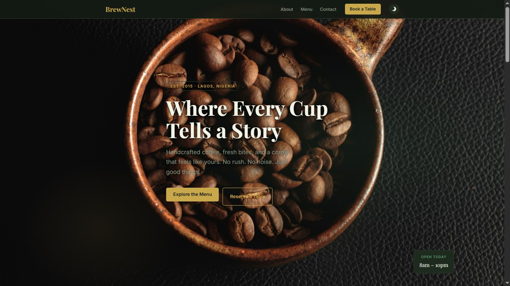
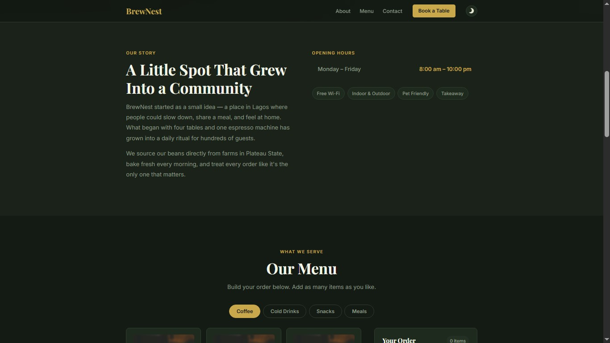
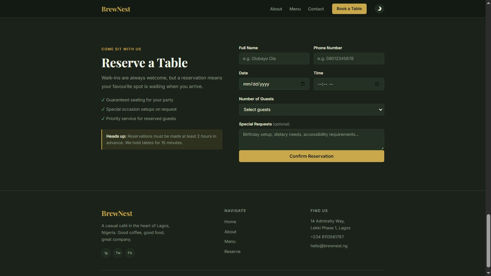
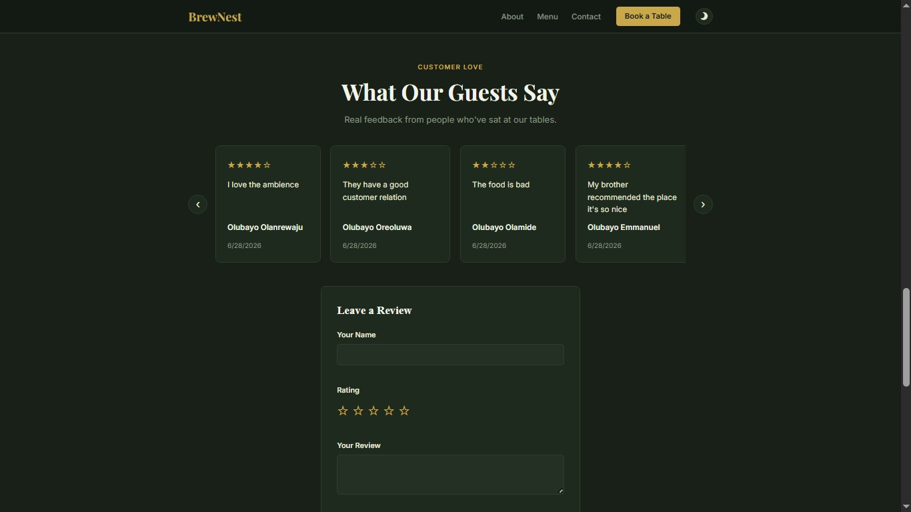

# BrewNest — Coffee & Kitchen ☕

A responsive café website for a fictional Lagos-based coffee shop. Built with vanilla HTML, CSS, and JavaScript (ES Modules).

**Live features:** menu ordering, table reservations, customer reviews, PDF receipt download, and dark/light theme toggle.

---

## Features

- **Menu & Cart** — Browse items by category (Coffee, Cold Drinks, Snacks, Meals), add to cart, adjust quantities, and place an order
- **PDF Receipt** — Download a printable receipt after placing an order (powered by jsPDF)
- **Table Reservation** — Book a table with full form validation
- **Customer Reviews** — Leave star-rated reviews; they persist via localStorage
- **Dark / Light Theme** — Toggle persists across sessions via localStorage
- **Scroll Animations** — Reveal-on-scroll effects using IntersectionObserver
- **Responsive Design** — Mobile-first layout with a hamburger nav on small screens

---

## Project Structure

```
brewnest/
├── index.html
├── style.css
├── app.js                  # Entry point
├── data/
│   └── menuData.js         # Menu items array
├── src/
│   ├── menu.js             # Menu rendering & tabs
│   ├── cart.js             # Cart logic & order modal
│   ├── reservation.js      # Reservation form & confirmation
│   ├── review.js           # Reviews carousel & form
│   ├── theme.js            # Dark/light mode toggle
│   └── animation.js        # Scroll reveal animations
└── assets/                 # Food & drink images
```

---

## Getting Started

No build tools or dependencies required — just open in a browser.

```bash
git clone https://github.com/your-username/brewnest.git
cd brewnest
```

Then open `index.html` directly in your browser, **or** use a local server to avoid ES Module CORS issues:

```bash
# Using VS Code Live Server extension (recommended)
# Or with Node.js:
npx serve .
```

> **Note:** The site uses ES Modules (`type="module"`), so opening `index.html` via `file://` may not work in all browsers. A local server is recommended.

---

## Tech Stack

| Tool | Purpose |
|---|---|
| HTML5 / CSS3 | Structure & styling |
| JavaScript (ES Modules) | All interactivity |
| [jsPDF](https://github.com/parallax/jsPDF) | PDF receipt generation |
| [Font Awesome](https://fontawesome.com/) | Icons |
| Google Fonts | Playfair Display & Inter |
| localStorage | Theme & review persistence |

---

## Screenshots






---

## Author

Built by [Olubayo](https://github.com/Olaolubayo).

---

## License

This project is open source and available under the [MIT License](LICENSE).
